# 🔬 Financial Research Agent (SEC + Anti-Hallucination)

An **LLM-powered research system** that extracts verified facts from SEC filings — solving the "hallucination problem" in financial AI.

## The Problem
Deep research agents are powerful, but they **invent numbers**. For finance, an agent that guesses "Revenue was $35B" is dangerous.

## The Solution
This system uses a **verification-first architecture**. The LLM acts as a *narrator*, not a source of truth. It can only write about facts that have been **extracted, verified, and stored** in a trusted FactStore.

---

## 🏗️ System Architecture

The system processes queries through a strict **Trust Hierarchy**, ensuring authoritative data (SEC) always overrides unverified sources (News).

```mermaid
flowchart TB
    UserQuery("🗣️ User Query") --> Classifier{{"🧠 Classification"}}
    
    Classifier -->|Financials| Tier1["🟢 Tier 1: SEC XBRL<br/>(Trusted API)"]
    Classifier -->|Risks/Strategy| Tier2["🟡 Tier 2: SEC HTML<br/>(LLM Extraction)"]
    Classifier -->|Sentiment| Tier3["🟠 Tier 3: News/Web<br/>(Discovery)"]
    
    Tier1 --> FactStore[("💾 FactStore<br/>(Verified Data Only)")]
    
    Tier2 --> GateA{{"🔒 Gate A<br/>Verify against Source"}}
    GateA -->|Verified| FactStore
    GateA -->|Hallucination| Reject["❌ Reject"]
    
    Tier3 --> GateB{{"🔒 Gate B<br/>Cross-Check"}}
    GateB -->|Corroborated| FactStore
    
    FactStore --> Narrator["📝 LLM Narrator"]
    Narrator --> FinalReport("📄 Final Report")
```

---

## 🧠 Hard vs. Soft Context

The system distinguishes between questions that need **authoritative facts** vs. **market sentiment**.

| Context Type | Source | Verification | Trust | When to Use |
|--------------|--------|--------------|-------|-------------|
| **Hard Context** | SEC XBRL, SEC Filings | **Gate A**: Must exist in source doc | 🥇 High | "What was Apple's Q3 revenue?" |
| **Soft Context** | News, Web Search | **Gate B**: Cross-check vs FactStore | 🥉 Lower | "What is the market sentiment on AI?" |

**Deep Research Integration:**
For soft context queries, the system can hand off to a **Deep Research Agent** (LangGraph multi-agent) to browse the web, but its findings are treated as *unverified claims* until they pass **Gate B** (cross-check against the authoritative FactStore).

---

## 📈 Signal Detection (Drift Analysis)

Beyond just extracting facts, the system detects **hidden risks** by comparing the language of a company's "Risk Factors" (Item 1A) across different years.

**How it works:**
1. **Fetch** current and previous 10-K filings.
2. **Extract** Item 1A (Risk Factors).
3. **Compare** using semantic similarity (Vector Embeddings).
4. **Flag** significant drift:
   - **New sentences** (emerging risks)
   - **Removed sentences** (resolved risks)
   - **Keyword shifts** (e.g., increased mention of "regulation" or "AI")

> **Example:** If a company adds "We may face regulatory action regarding our AI products" *before* any public announcement, the Drift Engine flags this as a high-priority signal.

---

## 🚀 Research Workflow

1. **Classify & Route**: The agent determines if the user wants *hard numbers* (XBRL), *strategic risks* (SEC Text), or *market sentiment* (News).
2. **Extract & Verify**:
   - **Hard Numbers**: Pulled directly from SEC EDGAR API.
   - **Text Claims**: Extracted by LLM, then **verified** by checking if the exact sentence exists in the source document.
3. **Store**: Only verified facts enter the **FactStore**.
4. **Narrate**: The final report is generated by an LLM that is **constrained** to only use data from the FactStore.

---

## 🛠️ Technical Stack
- **LangChain / LangGraph**: Orchestration and agent workflows
- **SEC EDGAR API**: Real-time financial data
- **Pydantic**: Strict data validation
- **Vector Search**: Semantic similarity for drift detection

---

### Based on Open Deep Research
This project extends [LangChain's Open Deep Research](https://github.com/langchain-ai/open_deep_research) with financial verification layers.
