# Deep Research System: Visual Architecture Diagrams

> All diagrams are in Mermaid format for easy rendering in GitHub, VS Code, or any Mermaid-compatible viewer.

---

## 1. Complete System Flow (High Level)

---

## 2. Trust Hierarchy & Data Flow

```mermaid
flowchart LR
    subgraph SOURCES["DATA SOURCES"]
        T1[("🏛️ TIER 1<br/>SEC XBRL<br/>trust=1.0")]
        T2[("📄 TIER 2<br/>SEC HTML<br/>trust=0.85")]
        T3[("🌐 TIER 3<br/>Web/News<br/>trust=0.6")]
        TX[("❌ REJECTED<br/>Unverified<br/>trust=0.0")]
    end

    subgraph GATES["VERIFICATION GATES"]
        GA["🚧 GATE A<br/>─────────<br/>• sentence_string exists?<br/>• numeric match ≤5%?"]
        GB["🚧 GATE B<br/>─────────<br/>• text provenance?<br/>• cross-verify vs SEC?"]
    end

    subgraph STORE["FACTSTORE"]
        FS[(FactStore<br/>─────────<br/>ONLY accepts:<br/>• exact_match<br/>• approximate_match)]
    end

    T1 -->|"auto-verified"| FS
    T2 --> GA -->|"✅ pass"| FS
    T2 --> GA -->|"❌ fail"| TX
    T3 --> GB -->|"✅ pass"| FS
    T3 --> GB -->|"❌ fail"| TX

    style T1 fill:#2ecc71,stroke:#333
    style T2 fill:#3498db,stroke:#333
    style T3 fill:#f39c12,stroke:#333
    style TX fill:#e74c3c,stroke:#333
    style GA fill:#ff6b6b,stroke:#333,stroke-width:2px
    style GB fill:#ff6b6b,stroke:#333,stroke-width:2px
    style FS fill:#4ecdc4,stroke:#333,stroke-width:3px
```

---

## 3. Gate A: Tier 2 Verification Detail

```mermaid
flowchart TB
    subgraph INPUT["LLM EXTRACTION OUTPUT"]
        FACT["Fact<br/>─────────<br/>metric: 'revenue'<br/>value: 35000000000<br/>sentence_string: 'Revenue was $35B'<br/>verification_status: 'unverified'"]
    end

    subgraph GATE["GATE A VERIFICATION"]
        Q1{"Has numeric<br/>value?"}
        
        subgraph NUMERIC["NUMERIC PATH"]
            N1["Extract number from<br/>sentence_string"]
            N2["Normalize scale<br/>'$35B' → 35000000000"]
            N3{"Compare to<br/>fact.value"}
            N4["≤1% → exact_match"]
            N5["≤5% → approximate_match"]
            N6[">5% → mismatch"]
        end
        
        subgraph TEXT["TEXT PATH"]
            T1["Normalize source HTML<br/>NFKC + whitespace"]
            T2["Normalize sentence_string"]
            T3{"substring<br/>match?"}
            T4["Found → exact_match"]
            T5["Not found → mismatch"]
        end
    end

    subgraph OUTPUT["RESULT"]
        PASS["✅ Can enter FactStore"]
        FAIL["❌ BLOCKED + logged"]
    end

    FACT --> Q1
    Q1 -->|YES| N1 --> N2 --> N3
    N3 -->|"≤1%"| N4 --> PASS
    N3 -->|"1-5%"| N5 --> PASS
    N3 -->|">5%"| N6 --> FAIL
    
    Q1 -->|NO| T1 --> T2 --> T3
    T3 -->|YES| T4 --> PASS
    T3 -->|NO| T5 --> FAIL

    style PASS fill:#2ecc71,stroke:#333
    style FAIL fill:#e74c3c,stroke:#333
```

---

## 4. Section Router (Semantic Classification)

---

## 5. Signal Detection Pipeline

```mermaid
flowchart TB
    subgraph INPUT["INPUT"]
        Q["Query: 'Red flags in NVDA?'"]
        F1["Current 10-K"]
        F2["Previous 10-K"]
    end

    subgraph EXTRACT["EXTRACTION"]
        LOC1["Section Locator<br/>Current Item 1A"]
        LOC2["Section Locator<br/>Previous Item 1A"]
    end

    subgraph ANALYSIS["DRIFT ANALYSIS"]
        TOK["Sentence Tokenization<br/>NLTK/spaCy"]
        
        subgraph METRICS["COMPUTE METRICS"]
            M1["Jaccard Distance<br/>(structural change)"]
            M2["Semantic Similarity<br/>(embeddings)"]
            M3["Keyword Delta<br/>(risk terms)"]
            M4["Boilerplate %<br/>(filter noise)"]
        end
        
        SCORE["drift_score: 0-100<br/>new_sentence_count: N<br/>removed_sentence_count: N"]
    end

    subgraph CLASSIFY["SEVERITY"]
        SEV{">50?"}
        CRIT["🔴 CRITICAL"]
        MOD["🟡 MODERATE"]
        LOW["🟢 LOW"]
    end

    subgraph OUTPUT["OUTPUT"]
        CHECK{"confidence<br/>== LOW?"}
        STORE["SignalStore<br/>(persist)"]
        SKIP["❌ Not persisted"]
        ALERT["Alert with<br/>top changes"]
    end

    Q --> F1 & F2
    F1 --> LOC1
    F2 --> LOC2
    LOC1 & LOC2 --> TOK --> M1 & M2 & M3 & M4
    M1 & M2 & M3 & M4 --> SCORE --> SEV
    SEV -->|YES| CRIT
    SEV -->|"20-50"| MOD
    SEV -->|"<20"| LOW
    CRIT & MOD & LOW --> CHECK
    CHECK -->|YES| SKIP
    CHECK -->|NO| STORE --> ALERT

    style CRIT fill:#e74c3c,stroke:#333
    style MOD fill:#f39c12,stroke:#333
    style LOW fill:#2ecc71,stroke:#333
    style SKIP fill:#95a5a6,stroke:#333
```

---

## 6. Deep Search Agent Graph (Planned)

---

## 7. Narrator Flow

```mermaid
flowchart TB
    subgraph INPUT["INPUTS"]
        FS[(FactStore<br/>verified facts)]
        Q["Original Question"]
        E["Entity: AAPL"]
    end

    subgraph FILTER["FACT FILTERING"]
        FILT["Filter by entity"]
        CHECK{"Facts<br/>found?"}
    end

    subgraph NARRATE["NARRATION"]
        PROMPT["Build Prompt<br/>─────────<br/>• List facts<br/>• Include tiers<br/>• Include sources"]
        LLM["Claude LLM"]
        
        subgraph RULES["NARRATOR RULES"]
            R1["ONLY use provided facts"]
            R2["NO fabrication"]
            R3["Cite with [fact_id]"]
            R4["Hedge by tier"]
        end
    end

    subgraph OUTPUT["OUTPUT"]
        EMPTY["NarratedReport<br/>insufficient_data=True<br/>'I don't have facts...'"]
        REPORT["NarratedReport<br/>─────────<br/>answer: '...'<br/>facts_used: [...]<br/>citations: [...]"]
    end

    FS --> FILT --> CHECK
    Q --> FILT
    E --> FILT
    CHECK -->|NO| EMPTY
    CHECK -->|YES| PROMPT
    PROMPT --> LLM
    LLM --> REPORT
    RULES -.-> LLM

    style EMPTY fill:#e74c3c,stroke:#333
    style REPORT fill:#2ecc71,stroke:#333
    style FS fill:#4ecdc4,stroke:#333,stroke-width:2px
```

---

## 8. FactStore Hard Gates

```mermaid
flowchart TB
    subgraph INPUT["INCOMING FACT"]
        FACT["Fact object"]
    end

    subgraph GATES["FACTSTORE HARD GATES"]
        G1{"verification_status<br/>∈ {exact_match,<br/>approximate_match}?"}
        G2{"location<br/>exists?"}
        G3{"location.cik OR<br/>location.article_url?"}
    end

    subgraph RESULT["RESULT"]
        STORED["✅ STORED<br/>in FactStore"]
        ERR1["❌ ValueError<br/>'Cannot add unverified'"]
        ERR2["❌ ValueError<br/>'Must have location'"]
        ERR3["❌ ValueError<br/>'Must have CIK or URL'"]
    end

    FACT --> G1
    G1 -->|NO| ERR1
    G1 -->|YES| G2
    G2 -->|NO| ERR2
    G2 -->|YES| G3
    G3 -->|NO| ERR3
    G3 -->|YES| STORED

    style STORED fill:#2ecc71,stroke:#333,stroke-width:2px
    style ERR1 fill:#e74c3c,stroke:#333
    style ERR2 fill:#e74c3c,stroke:#333
    style ERR3 fill:#e74c3c,stroke:#333
```

---

## 9. Complete Tier 2 Pipeline (End-to-End)

---

## 10. Degraded Mode Handling

```mermaid
flowchart TB
    subgraph CHECKS["DEPENDENCY CHECKS"]
        C1{"sentence-transformers<br/>available?"}
        C2{"ANTHROPIC_API_KEY<br/>set?"}
        C3{"SEC_USER_AGENT<br/>set?"}
    end

    subgraph MODES["OPERATING MODES"]
        FULL["🟢 FULL MODE<br/>─────────<br/>All tiers available<br/>Semantic routing<br/>Full narration"]
        
        DEG1["🟡 DEGRADED: NO EMBEDDINGS<br/>─────────<br/>Jaccard fallback<br/>Keyword routing only<br/>Lower accuracy"]
        
        DEG2["🔴 DEGRADED: NO LLM<br/>─────────<br/>No Tier 2 extraction<br/>No narration<br/>XBRL only"]
        
        DEG3["🔴 DEGRADED: NO SEC<br/>─────────<br/>Tier 1/2 unavailable<br/>Web/News only<br/>Limited trust"]
    end

    C1 -->|YES| C2
    C1 -->|NO| DEG1
    C2 -->|YES| C3
    C2 -->|NO| DEG2
    C3 -->|YES| FULL
    C3 -->|NO| DEG3

    style FULL fill:#2ecc71,stroke:#333
    style DEG1 fill:#f39c12,stroke:#333
    style DEG2 fill:#e74c3c,stroke:#333
    style DEG3 fill:#e74c3c,stroke:#333
```

---

## How to Use These Diagrams

### In GitHub
GitHub automatically renders Mermaid diagrams in markdown files.

### In VS Code
Install the "Markdown Preview Mermaid Support" extension.

### Export to PNG/SVG
Use [mermaid.live](https://mermaid.live) to export diagrams.

### In Presentations
Copy Mermaid code to mermaid.live, export as PNG, embed in slides.

